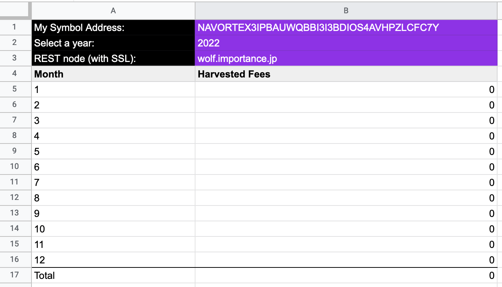
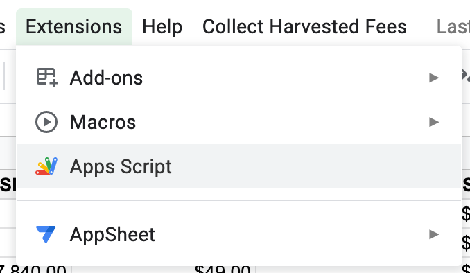
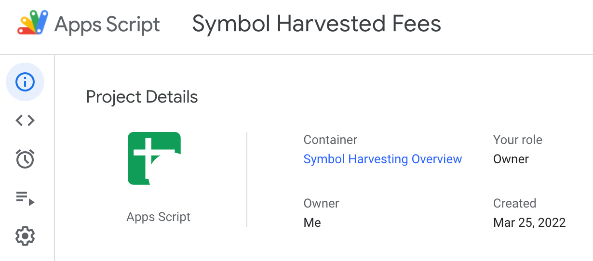
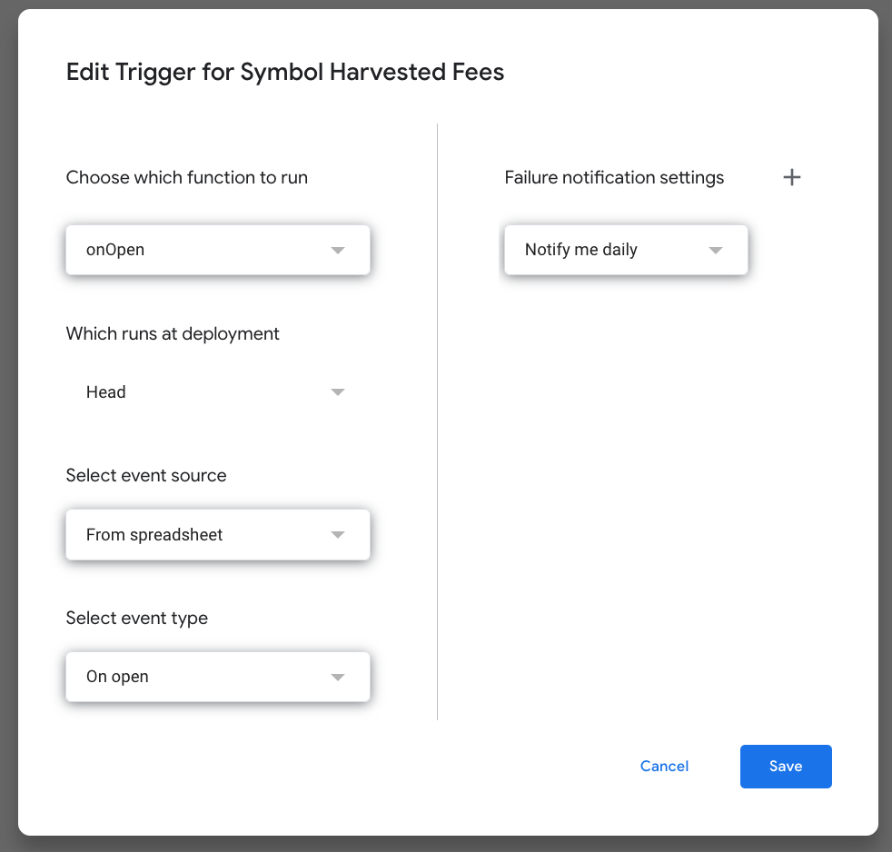
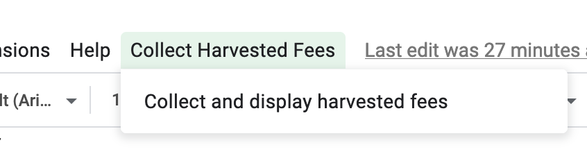

# symbol-harvest-collector
An automation script with Google Apps Script that collect harvested fees by your harvesting account and display them in Google Sheets

### How to set up ###
1. Create a Sheet in Google Sheets and give it a name. E.g: `Symbol Harvesting Overview`  
2. Inside the active sheet, make a table as follows:  
    
3. Go to Google Apps Script from the menu: "Extensions" > "Apps Script"  
   
4. Create a project in Google Apps Script and give it a name. E.g.: `Symbol Harvested Fees`  
5. Import or create `.gs` files into the `Files` directory.  
    **Note**: The code can be placed together into one `.gs` file.
6. In the `Project Details` page, choose the desired Google Sheets document as the container.  
   
7. You may also want to create a trigger with the following configuration:
   

> ⚠️ You may need to **authorize** your script when it's run for the first time.

 

### How to use ###
1. Open the Google Sheet that was created in the previous step.
2. A new custom menu will appear in the menu bar next to the `Help` menu. E.g.: Collect Harvested Fees  
   
3. Click the new custom menu and let it run until it's finished.
> ⚠️ The script is a blocking script and is not optimized. It may take time before it's finished. 
